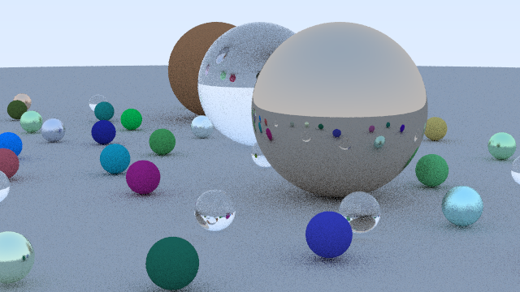

# 🐝 WASMHive Runtime

The Rust core of **WASMHive**: a distributed computing framework that turns ordinary browser tabs into compute workers. A native Rust master splits a job into chunks, ships a WASM module plus data to browser workers over WebRTC data channels, and reduces the returned results locally. No installs on worker machines, if it has a browser it can join the hive.

The browser side (signaling server, CORS proxy, and the worker page) lives in [WASMHive-WebApp](https://github.com/WASMHive/WASMHive-WebApp). The containerized baseline we benchmark against lives in [docker-hive](https://github.com/WASMHive/docker-hive).

> Built as a PES University computer science capstone (2025-2026). The project is complete and stable; it is not under active development, but everything here runs as documented.

## 🏗️ Architecture

```
┌─────────────────┐    WebSocket     ┌──────────────────┐
│   Master Node   │◄────────────────►│    Signaling     │
│  (Rust binary)  │   Registration   │      Server      │
└─────────────────┘                  │(WASMHive-WebApp) │
         │                           └──────────────────┘
         │ WebRTC Data Channels               │
         ▼                                    ▼ Peer discovery
┌─────────────────┐                  ┌─────────────────┐
│ Worker (browser)│                  │ Worker (browser)│
│  WASM executor  │                  │  WASM executor  │
└─────────────────┘                  └─────────────────┘
```

A job is defined by four pieces the application supplies:

1. a **chunker** that splits the input,
2. a named **WASM map function** that runs on workers,
3. an **encoder/decoder** pair for the wire format (bytes + JSON meta),
4. a **reducer** that combines results on the master.

The runtime handles WASM compilation (via `wasm-pack`), worker discovery, WebRTC setup, task distribution, retries and reassignment on worker failure, and result collection.

## 📁 Workspace

| Crate | What it is |
|---|---|
| `distribute_runtime` | The runtime library: signaling client, WebRTC master, binary protocol, pull scheduler, fault tolerance |
| `examples` | The WASM module shipped to workers (`cpu_map`, `gpu_map` via WebGPU, `grayscale_frame_rgba`, `fetch_url_title`) plus a numeric map-reduce demo |
| `examples_raytrace` | Distributed path tracer: tiles rendered across the hive, assembled into a PNG. Fully self-contained crate carrying its own WASM module |
| `examples_bw` | Distributed video grayscale: ffmpeg frame extraction, per-frame map on workers, re-encode |
| `examples_webcrawl` | Distributed URL title extraction over a URL list |
| `benchmark` | Throughput/latency benchmark suite (`run_benchmark.sh`) |

## 🎨 Showcase: distributed path tracing



```bash
cargo run -p examples_raytrace              # 640x360, 24 samples/pixel
cargo run -p examples_raytrace -- 1280 720 64 render.png
```

Every 80x80 tile is one task; browser tabs pull tiles from the queue and tabs opened mid-render join in automatically. Rendering is deterministic (per-pixel seeded RNG), so a retried or duplicated tile is byte-identical and the same image hashes out no matter how many workers ran it. Measured on one laptop with headless Chrome workers: 4.9s with one worker tab, 2.3s with two, identical output hashes.

## 🚀 Quick start

Prerequisites: Rust, [`wasm-pack`](https://rustwasm.github.io/wasm-pack/), Node.js (for the signaling server), and `ffmpeg`/`ffprobe` for the video example.

1. Start the signaling server and open one or more worker tabs, following [WASMHive-WebApp](https://github.com/WASMHive/WASMHive-WebApp).
2. Run an example from this repo:

```bash
# Distributed path tracer (writes raytrace_out.png)
cargo run -p examples_raytrace

# Numeric map-reduce (CPU/GPU)
cargo run -p distributed_examples

# Video grayscale (writes bw_output.mp4)
cargo run -p examples_bw -- input.mp4 30

# Web crawl (needs the CORS proxy from WASMHive-WebApp; writes webcrawl_results.txt)
cargo run -p examples_webcrawl                    # uses the bundled sample_urls.txt
cargo run -p examples_webcrawl -- my_urls.txt     # or your own list, one URL per line
```

Each worker tab shows the network topology, task history, and health status while jobs run.

## 📊 Benchmarking

```bash
./run_benchmark.sh
# or
cargo run -p benchmark -- --workers 1,2,4 --task-sizes 100,1000 --mode both --iterations 5
```

See `benchmark/README.md` for options. For the Docker comparison baseline, see [docker-hive](https://github.com/WASMHive/docker-hive).

## 🧩 Write your own workload

A workload is one crate; the framework does not change. The recipe:

1. A `lib.rs` with `crate-type = ["cdylib", "rlib"]` exporting map functions with the worker contract, sync or async:

```rust
#[wasm_bindgen]
pub fn my_map(input: Vec<u8>, meta: JsValue) -> Vec<u8> {
    // bytes in, bytes out; meta carries small JSON you attach per chunk
}
```

2. A `main.rs` that supplies four closures and points the job at your crate:

```rust
let result = run_distributed_mapreduce_bytes_opts(
    input,
    "my_map",
    chunker,        // Input -> Vec<Input>
    reducer,        // Vec<ItemOutput> -> FinalOutput (chunk order preserved)
    encode_chunk,   // Input -> (Vec<u8>, serde_json::Value)
    decode_result,  // (Vec<u8>, serde_json::Value) -> ItemOutput
    JobOptions {
        module: ModuleSource::CompileCrate(env!("CARGO_MANIFEST_DIR").into()),
        ..JobOptions::default()
    },
).await?;
```

Workers cache your module by content hash, tasks stream over a pull queue with per-worker pipelining, failed or slow tasks are retried on other workers, and missing chunks follow your `MissingChunkPolicy` (`Fail` by default, `AllowPartial` for gap-tolerant jobs). `examples_raytrace` is a complete ~450-line reference.

## 🗺️ Roadmap

Active work is tracked in [docs/roadmap.md](docs/roadmap.md). Landed: binary wire protocol, unified byte pipeline, ordered results with explicit missing-chunk policy, content-hash module store, pull scheduling with mid-job worker absorption. Next up: Web Worker execution in the tab, configurable STUN/TURN, and a hosted hive.

## 📄 License

MIT
